# projetUml
Projet donné par Jean simplon.co

## Sommaire:

  1. Les attentes
  2. UseCase
  3. Activity Diagram 
  4. Class Diagram
  5. Sequence Diagram
  
 
Les attentes:
 
    Lors de ce projet, il était attendu de représenter les différents schémas UML concernant la conception d'une plateforme de formation,
    nous devions gérer les acteurs suivant :
    
      -Le directeur de région
      -L'apprenant
      -Le Formateur
      -Le chargé de promo
      -L'administrateur
      -Le visiteur
  
  ## Les diagrammes de cas d'utilisation:
  
  Voici le diagramme global des cas d'utilisation:
      
  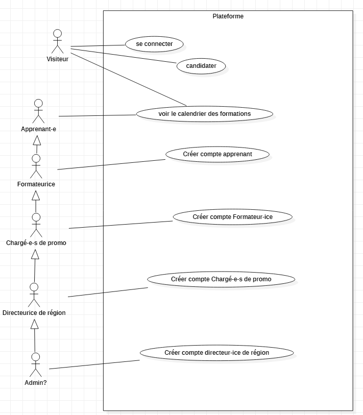
      
Ce diagramme montre les actions communes à tous les utilisateurs.
      
      Nous pouvons voir sur ce diagramme les différentes actions des Utilisateurs:
      
        - Le visiteur doit pouvoir: Se connecter, candidater et voir le calendrier des formations.
        - L'apprenant doit pouvoir: voir le calendrier des formations.
        - Le formateur doit pouvoir: voir le calendrier des formations mais aussi pouvoir créer le compte apprenant.
        - Le chargé de promo doit pouvoir: voir le calendrier des formations, créer le compte apprenant, et créer le compte formateur.
        - Le directeur de région doit pouvoir: voir le calendrier des formations, créer le compte apprenant, créer le compte formateur, créer le compte chargé de promo.
        - L'administrateur à tous les droit des autres acteurs en plus de la création de compte directeur de région.

  ### Voici le diagramme des cas d'utilisation propre à l'apprenant:
  
  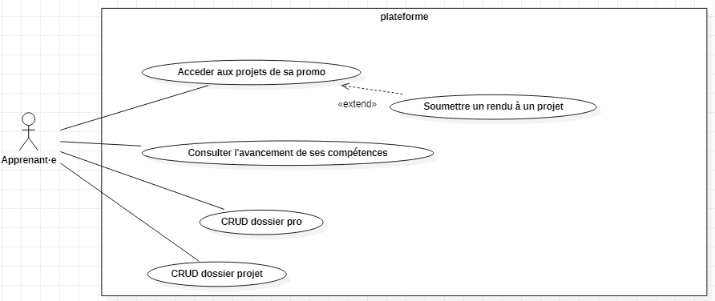
  
  Ce diagramme montre les différentes actions que peuvent effectuer les apprenants:
      
      - L'apprenant peut accèder aux projets de sa promo, il a la possibilité de soumettre un rendu à un projet sur cette action.
      - Il peut consulter l'avancement de ses compétences.
      - Il peut créer, modifier, afficher, supprimer un dossier pro.
      - Il peut aussi créer, modifier, afficher, supprimer un dossier de projet.
   
  ### Voici le diagramme des cas d'utilisation propre au chargé de promos:
  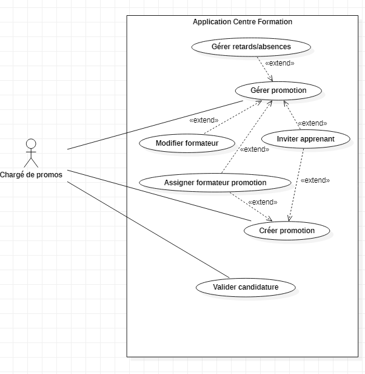
  
   Ce diagramme montre les différentes actions que peuvent effectuer les chargés de promos:
      
      - Le chargé de promotion doit pouvoir gérer les promotions, en effectuant cette action, il peut avoir la possibilité de : gérer les retards et les absences, inviter un apprenant à la promotion, assigner un formateur à la promotion et modifier le dit formateur.
      - Il doit aussi pouvoir créer la promotion, à partir de cette action il doit pouvoir assigner de nouveaux formateurs et inviter des apprenants.
      - Et doit pouvoir valider une candidature

  ### Le diagramme des cas d'utilisation du directeur de région:
  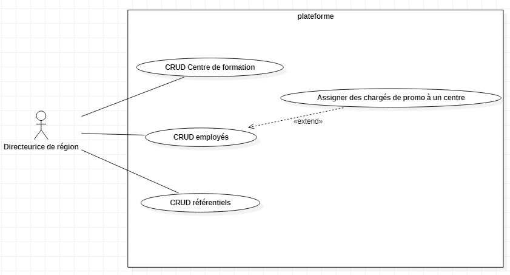
        
  Ce diagramme représente les actions possibles pour le directeur de région:
      
      - Créer, modifier, afficher, supprimer un centre de formation
      - Créer, modifier, afficher, supprimer un employé, avoir la possibilité d'assigner des chargés de promo à un centre
      - Créer, modifier, afficher, supprimer un référentiel.

  ### Le diagramme des cas d'utilisation du formateur:
  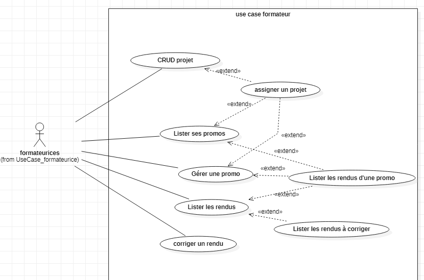
  
  Ce diagramme représente les actions possibles pour le formateur:
      
      - Créer, modifier, afficher, supprimer un projet, il pourra assigner une promotion à un projet.
      - Lister les promotions, le formateur aura la possibilité: d'assigné un projet et de lister les rendus d'une promotion lors du listage de ses promotions.
      - Gérer une promotion, le formateur aura la possibilité: d'assigner un projet et de lister les rendus d'une promotion lorsqu'il voudra gérer une promotion.
      - Lister les rendus, le formateur pourra lister les rendus d'une promotion et lister les rendus à corriger.
      - Corriger un rendu
      
  ## Les diagrammes d'activité:
  
  ### Gestion de retards et d'absence:
    
  Voici le diagramme d'activité concernant la gestion de retards et d'absences:
  
  
    Le chargé de promos accède à la page de gestion de retards et d'absences, le diagramme d'activité représente les cas suivants :
    
        - Si l'option sélectionnée est "Gestion absences" l'application liste les promotions, nous permet de sélectionner une promotion et nous offre la possibilité de cocherles absents puis nous validons pour atteindre la fin du processus.
        - Si l'option sélectionnée est "Gestion retards" l'application liste les promotions, nous permet de sélectionner une promotion et nous offre la possibilité de cocher les retardataire avant de valider pour atteindre la fin du processus.

  ### Modification formateur:
  
  Voici le diagramme d'activité concernant la gestion de la modification d'un formateur:
  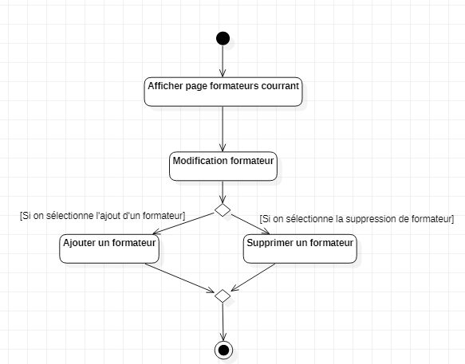
  
    Le chargé de promos accède à la page de gestion des formateurs, le diagramme d'activité représente les cas suivants:
      
        - Si l'option modificateur est appelée pour ajouter un formateur, on ajoute un formateur et on termine le processus.
        - Si l'option supprimer est sélectionné, nous supprimons l'utilisateur et on termine le processus.

  ### Assignation et corrigé projet:
  
  Voici le diagramme d'activité concernant l'assignation et le corrigé de projet:
  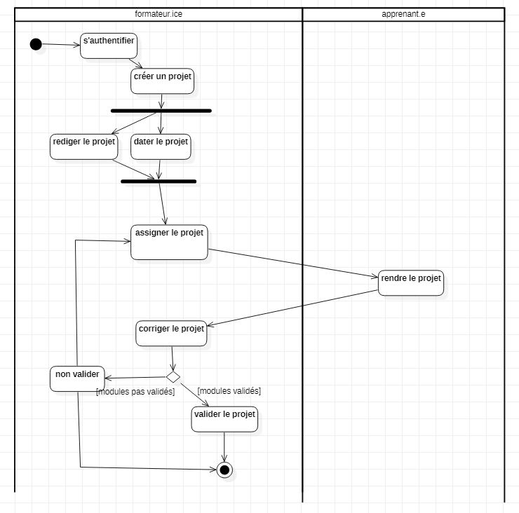
  
    Le formateur accède à la page de gestion de projet, le diagramme d'activité représente les cas suivants :
    
        - Lors de la création d'un projet, rediger le projet ainsi que dater le projet est fait lors de la création de celui-ci.
        - Par la suite, nous assignons le projet et l'apprenant rend le projet.
        - Le formateur corrige le projet rendu par l'apprenant qu'il valide ou non.
        - Si le projet est validé, nous terminons le procéssus, s'il n'est pas validé, le projet lui ai réassigné.
  
  ### Création promotion:
  
  Voici le diagramme d'activité concernant la création d'une promotion:
  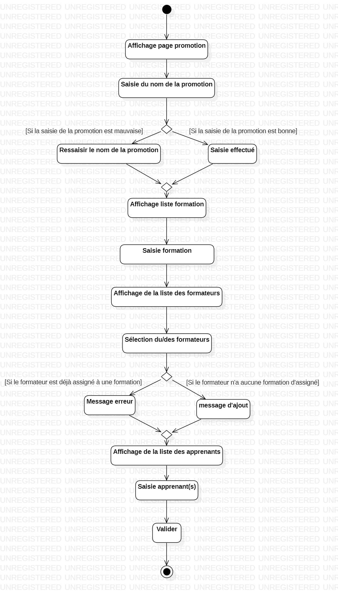
  
    Le chargé de promotion accède à la page de création de promotion et est invité à saisir le nom de la dite promotion:
      
        - Si le nom de la promotion est incorrect, nous invitons le chargé de promos à ressaisir le nom de la promotion.
        - Si le nom de la promotion est correct, nous affichons la liste des formations disponibles.
        - Nous invitons l'utilisateur à saisir la formation voulu pour la création de la promo
        - Par la suite nous proposons au chargé de promos de sélectionner le ou les formateurs.
        - Si le formateur est déjà assigné à une promo, nous renvoyons un message d'erreur et nous demandons la saisie d'un autre formateur.
        - Si le formateur n'est pas assigné à une promo, nous renvoyons un message de confirmation de l'ajout du formateur.
        - Nous sommes ensuite redirigé vers l'affichage des apprenants, nous avons le choix de selectionner des apprenants ou non en validant directement.

        
  ##  Diagrammes de classe:
  
  ### Gérer les centres de formation:
  
  Voici le diagramme de classe pour la gestion des centres de formation:
  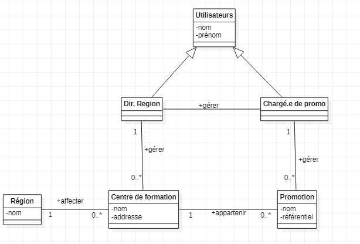
      
  ### Modification formateur:
  
  Voici le diagramme de classe pour la modification du formateur:
  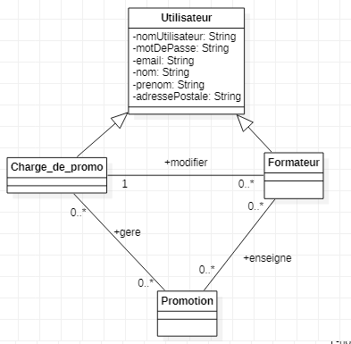
  
  ### Gestion des retards et des absences:
  
  Voici le diagramme de classe pour la gestion des retards et des absences:
  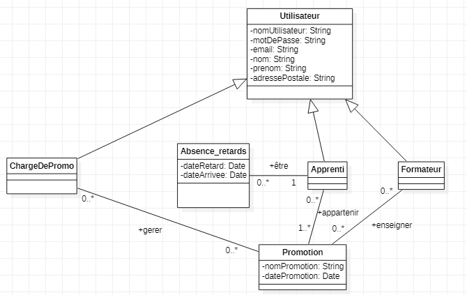
  
  ### Gestion des projets:
  
  Voici le diagramme de classe pour la gestion des projets:
  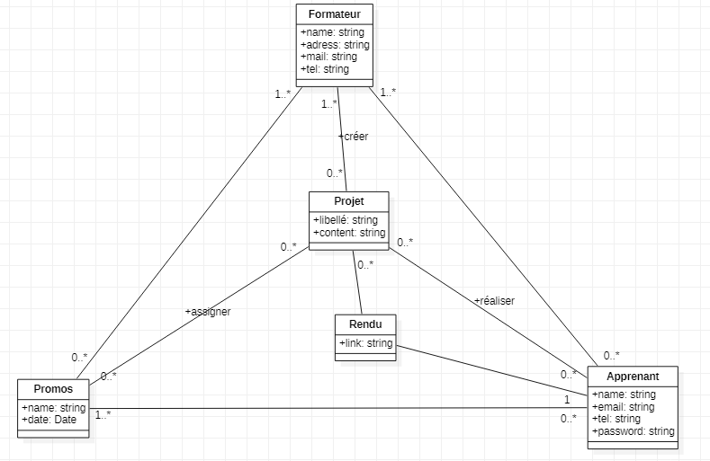
  
  ##  Diagrammes de séquence:
  ### Diagramme de séquence pour la création d'un nouveau centre:
  Voici le diagramme de séquence pour l'ajout d'un nouveau centre:
  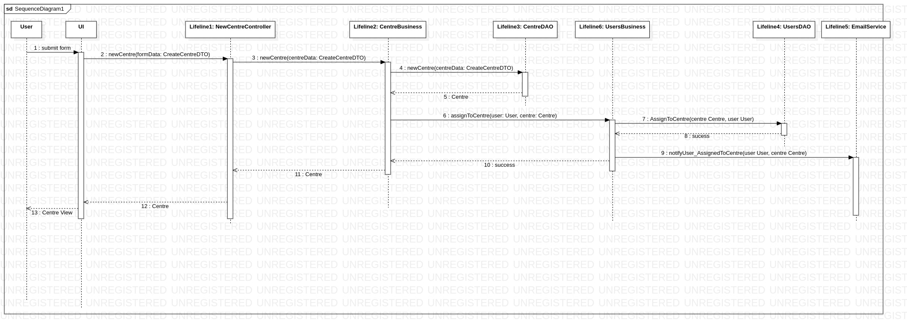
  
  ### Diagramme de séquence pour la gestion des retards:
  Voici le diagramme de séquence pour la gestion des retards:
  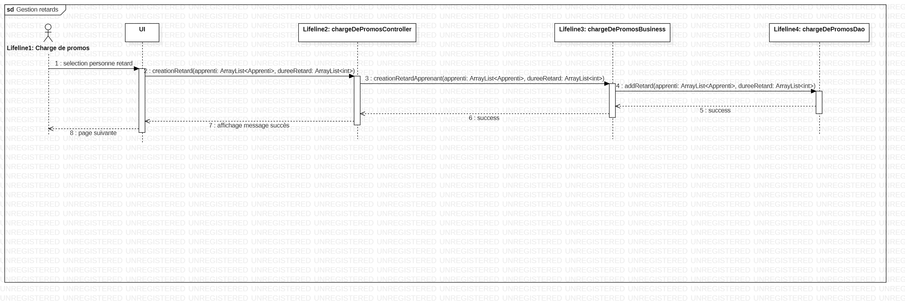
